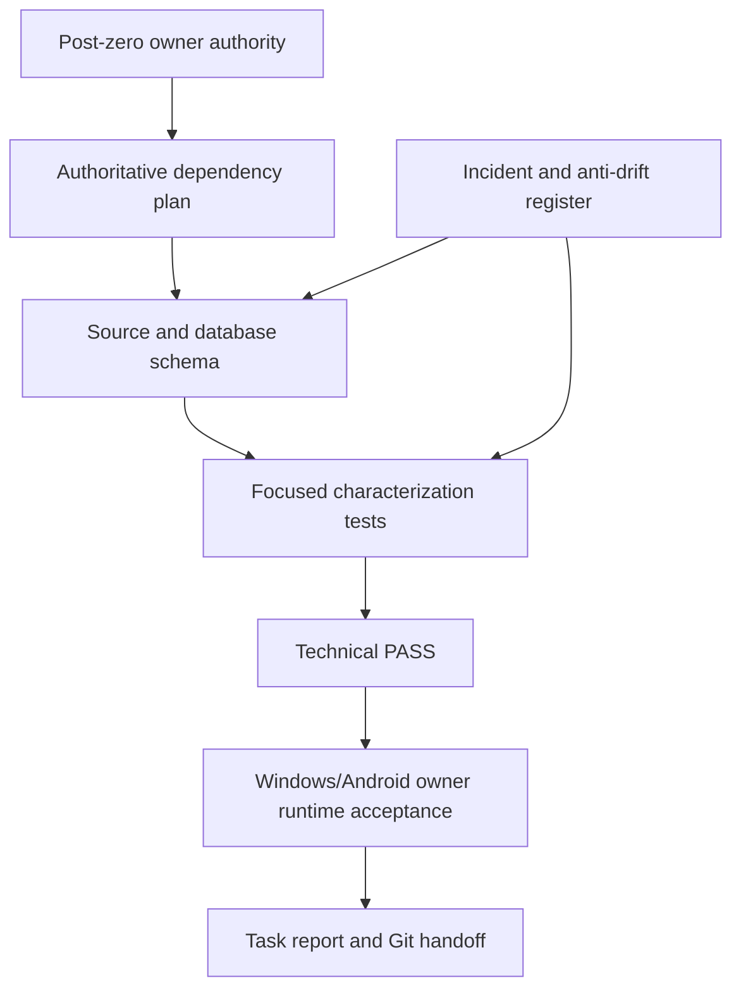
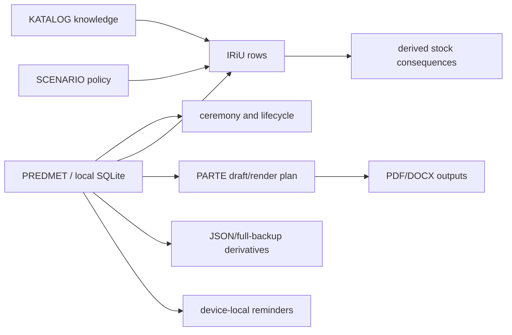

# OPC project navigation and dependency map

Status: post-zero working map for the stabilization program.

This document is a navigation aid. It is not a new business authority. PREDMET
remains the only business truth; this map points to the source, tests and
authoritative documents that must be read before a change.

## 1. Start here after opening the repository

1. Confirm branch, `HEAD`, upstream equality and a clean worktree.
2. Read the current owner authority and anti-drift documents:
   - `OPC_ZERO_BASELINE_AND_POST_ZERO_OWNER_AUTHORITY.md`
   - `OPC_INCIDENT_AND_ANTI_DRIFT_REGISTER.md`
   - `OPC_CURRENT_DEVELOPMENT_STATE.md`
   - `OPC_AUTHORITATIVE_DEPENDENCY_BASED_DEVELOPMENT_PLAN.md`
   - `OPC_PURPOSE_AND_ANTI_DRIFT_MANIFEST.md`
   - the newest applicable file in `docs/tasks/`.
3. Read this map, then follow the route for the affected subsystem below.
4. Source and tests decide technical facts. Owner decisions decide business
   policy. A test PASS never supplies owner approval.

## 2. Authority and evidence stack



The order is a control sequence, not a permission to skip a gate.

## 3. Repository map

| Area | Location | Role and boundary |
| --- | --- | --- |
| Application entry and platform wiring | `lib/app.dart`, `windows/`, `android/` | Startup, platform lanes and dependency injection. Do not change platform behavior while fixing a domain/UI defect unless the evidence requires it. |
| Authoritative local database | `lib/core/database/database.dart`, `lib/core/database/tables/` | Drift/SQLite schema, seed/recovery and local truth. Never use the canonical/live database for experiments. |
| PREDMET lifecycle | `lib/features/predmeti/data/`, `application/`, `presentation/` | Master business object and lifecycle. Changes require dependency and rollback review. |
| PARTE | `lib/features/predmeti/parte/`, `lib/features/predmeti/presentation/segments/parte_segment.dart` | Draft, render plan, preparation, PDF/DOCX handoff. Structural blocks and optional content must remain distinct. |
| IRiU | `lib/features/predmeti/presentation/segments/iriu_segment.dart`, `iriu_row_tile.dart`, `lib/features/predmeti/data/iriu_repository.dart` | Operational rows derived from PREDMET/SCENARIO rules. Preserve basic-before-scenario ordering and explicit user actions. |
| KATALOG | `lib/features/podesavanja/data/podesavanja_repository.dart`, `katalog_tab.dart`, `lib/core/database/tables/katalog_artikli_table.dart`, `assets/katalog_foto/` | Knowledge/catalog input. It may supply an article but never rewrites historical PREDMET truth. |
| Restore/JSON | `lib/core/utils/json_export_import.dart`, `lib/core/json_transfer/` | Transfer/backup derivatives and compatibility guards. Use isolated copies and backup-first procedure. |
| Reminders | `lib/features/predmeti/reminders/`, `full_backup_restore_coordinator.dart` | Device-local notification lifecycle. Device IDs are never portable. Do not reopen policy without an owner decision. |
| Settings and company data | `lib/features/podesavanja/` | Firma, catalog, templates and local configuration. Keep separate from PREDMET authority. |
| Stock consequences | `lib/features/stanje_robe/` | Derived operational state linked to IRiU/KATALOG. Preserve stable article IDs and lifecycle cleanup. |
| Tests | `test/` | Characterization, lifecycle, restore, PARTE, IRiU and UI evidence. Prefer focused tests before the final full suite. |
| Operational scripts | `scripts/` | Manifest and UTF-8/BOM validation. Use the .NET validator for encoding checks. |
| Public documentation | `docs/` | Git working copy of authoritative documentation. Reports preserve evidence and owner/runtime separation. |

## 4. Business and data flow



Derivatives never become parallel business authority. Historical PREDMET data
must not be rewritten by a later catalog or scenario change.

## 5. Broad stabilization task route

The current broad task is intentionally sequential on a separate task branch.

### Gate 0 — protection and scope

- Capture branch/HEAD/upstream/clean-tree evidence.
- Create a source backup in protected `BACKUPS` and a restore-point manifest in
  protected `RESTORE_POINTS` before app-code edits.
- Record owner runtime findings and unresolved security scope.
- Do not change application behavior in this gate.

### Gate 1 — PARTE correctness and user-facing text

Source route: `parte/domain/parte_composer.dart` →
`parte/data/parte_preparation_repository.dart` →
`parte/presentation/parte_composer_screen.dart`.

Required invariants:

- required structure remains present, but empty content is omitted and never
  blocks preparation;
- internal IDs such as `mourners` never appear in user messages;
- all changed strings are valid UTF-8 without BOM, mojibake or U+FFFD;
- the selected block's displayed size is the fitted/rendered size, not a stale
  draft default;
- accepted PDF/DOCX behavior and layout remain unchanged unless a focused test
  proves the correction requires it.

### Phase 3 — PREDMET explicit completion lifecycle

Source route: `lib/features/predmeti/data/predmeti_repository.dart` →
`lib/features/predmeti/presentation/predmet_screen.dart` →
`test/predmet_completion_state_characterization_test.dart`.

Automatic completion is retired: opening a PREDMET and starting the list no
longer write `ZAVRŠEN` from the ceremony date. The owner-approved lifecycle is
`OTVOREN → ZATVOREN → ZAVRŠEN`; only an explicit action from `ZATVOREN` may set
`ZAVRŠEN`. That action records a lifecycle audit event and makes the PREDMET
immutable for direct edits and reopening. Existing/imported `ZAVRŠEN` and
`ANONIMIZOVAN` rows remain compatible, and GDPR anonymization remains a
separate controlled operation.

Ceremony date, reminder state, PARTE preparation and derivative outputs never
infer completion. The implementation report and focused tests record the
owner gate; Windows/Android runtime acceptance remains separate.

Keep the lifecycle pseudocode and map synchronized:

- `docs/OPC_PSEUDOCODE_INDEX_FOR_LOGOS.md` (`OPC-PSEUDO-INDEX-055A`);
- `docs/OPC_AUTHORITATIVE_DEPENDENCY_BASED_DEVELOPMENT_PLAN.md` §12;
- `docs/OPC_OWNER_DECISION_GUIDE.md` §4;
- `docs/OPC_OWNER_DECISIONS_STATUSI_CEREMONIJA_PSEUDOCODE.md` §4.

### Gate 2 — IRiU/KATALOG performance

Source route: `iriu_segment.dart` / `iriu_row_tile.dart` →
`podesavanja_repository.dart` → `katalog_artikli` table and photo policy.

Gate 2A characterization is recorded in
`test/katalog_picker_repository_characterization_test.dart`. It preserves
visible category/article order, stable IDs, prices, `hasPhoto`, scoped loading
and separate photo-byte lookup. The synthetic in-memory run is diagnostic only
(cold/warm repository timings are printed without a threshold); it is not a
Windows/Android performance result.

The owner runtime measurement must separate repository await, dialog first
frame, photo read and image decode. The current source shows sequential
catalog-summary loading and per-article photo reads; this remains a hypothesis
until those boundaries are measured on the target fixtures.

Only then choose the smallest safe correction, such as one batched summary
query, bounded cache, deferred photo loading or an index proven by query plan.
Do not alter IRiU business ordering, PREDMET authority or article identity.

### Phase 3 — SCENARIO/IRiU mutation characterization

Source route: `iriu_segment.dart` lifecycle triggers →
`iriu_repository.dart` sync/add/delete paths → `core_v2` truth and lifecycle
services → STANJE ROBE consequences.

The characterization report and isolated tests are recorded in
`docs/tasks/OPC_TASK_PHASE3_SCENARIO_IRIU_MUTATION_CHARACTERIZATION_20260801_REPORT.md`
and `test/phase3_scenario_iriu_mutation_characterization_test.dart`.

Current evidence: required scenario rows are safely auto-created and repeated
syncs do not duplicate them; manual dismissal is remembered; explicit user
insertion remains possible. When a condition becomes non-applicable, current
code leaves the managed row stored while derived truth marks it inactive. That
stale state is a confirmed defect under the owner-approved ODQ-SCENARIO-001
direction, not an accepted retention policy.

The next implementation dependency is a controlled reconciliation contract:
scenario-owned provenance/snapshot, one business confirmation for an eligible
`OTVOREN` PREDMET, removal of stale rows and values, operational compensation,
and retry/rollback evidence. Do not patch deletion in isolation and do not
rewrite completed/locked PREDMET truth. Preserve INC-001 ordering evidence
until the Phase 4 owner gate.

Authority extension: SCENARIO is part of PREDMET authority; a PREDMET has no
valid state without its scenario snapshot. MODULI own scenario definitions,
defaults and UI configuration, while the selected scenario and applied IRiU
consequence snapshot remain PREDMET-owned. Existing hard-coded scenarios are
first migrated as module defaults and then exposed as UI-upgradeable defaults;
editing a module default must never silently rewrite an existing PREDMET.

### Phase 4 — MODULI/SCENARIO contract and UI-defined defaults

Current source route: static `ModuliScreen`/settings module tab → entitlement
enum → one `predmeti.businessScenarioId` → hard-coded evaluator/rules. The
schema-23 module/snapshot tables are additive only; no runtime repository,
materialization or scenario-definition UI consumes them yet.

Required future route: MODULI scenario definitions/defaults → versioned criteria
and consequence contract → explicit eligible-PREDMET assignment/snapshot →
IRiU provenance-aware reconciliation → STANJE ROBE/derivative consequences.
The selected scenario snapshot remains PREDMET authority; module-default edits
are prospective and never silently rewrite existing PREDMETI.

The contract audit, migration dependency and owner decision gates are recorded
in `docs/tasks/OPC_TASK_PHASE4_MODULE_SCENARIO_CONTRACT_AUDIT_20260801_REPORT.md`.
Do not add UI or schema by merely wrapping the current hard-coded evaluator:
criteria grammar, module scope, versioning, provenance, rollback and transfer
parity must be decided first.

The latest technical sanity-check is recorded in
`docs/tasks/OPC_TASK_SANITY_CHECK_AUTOREVIEW_20260802_REPORT.md`. It confirms
schema 23, `flutter analyze` PASS and the complete test-suite PASS, while
keeping repository/JSON materialization, reconciliation and SCENARIO UI behind
their dependency gates.

Phase 5 invariant hardening is recorded in
`docs/tasks/OPC_TASK_PHASE5_SCENARIO_PERSISTENCE_INVARIANTS_20260802_REPORT.md`.
It closes only the schema-1 constructor/normalization boundary and preserves
the golden payload/hash; it does not open any runtime data path.

Phase 6 adds the pure, versioned scenario transfer envelope recorded in
`docs/tasks/OPC_TASK_PHASE6_SCENARIO_TRANSFER_ENVELOPE_20260802_REPORT.md`.
The envelope preserves the schema-1 snapshot/hash verbatim, carries explicit
provenance coverage and deterministic provenance ownership, and rejects unknown
or future fields, duplicate IDs, malformed nested data and hash tampering. It
does not choose a single-PREDMET or full-backup carrier and is not wired to JSON,
Drift, repository, runtime, reconciliation, UI or PODSETNIK. The next dependency
is an owner-gated carrier/schema/parity design with atomic destination validation.

Phase 7 read-only audit evidence is recorded in
`docs/tasks/OPC_TASK_PHASE7_SCENARIO_CARRIER_PARITY_AUDIT_20260802_REPORT.md`.
The single-PREDMET carrier and full-backup carrier remain separate: their root
schemas, identity behavior, aggregate scope and legacy compatibility differ.
No carrier wiring is authorized until owner decisions cover root block/schema
versions, stable row identity/reassociation, snapshot/module availability,
manual/LEGACY transfer scope, coverage semantics, atomic rollback,
signing/privacy and Windows/Android semantic parity.

The owner subsequently accepted the five bounded carrier decisions recorded in
the Phase 7 report. The next dependency is a pure carrier-adapter contract with
explicit local-identity mapping and preflight tests; existing JSON/full-backup
runtime paths remain untouched until that contract is proven.

Phase 8 proves the Single-PREDMET adapter boundary in
`docs/tasks/OPC_TASK_PHASE8_SINGLE_PREDMET_CARRIER_ADAPTER_20260802_REPORT.md`.
It uses transfer indexes rather than source database IDs and requires explicit
destination resolution. It does not wire root schema 8, repository import,
reassociation, or runtime. Full-backup aggregate adaptation remains the next
separate dependency.

Phase 9 adds the first SCENARIO editor at the operational
`PREDMETI → MODULI` route. The screen persists OSNOVNI PAKET and definitions
through `ScenarioModuleRepository`; it is not part of PODEŠAVANJA and does not
apply definitions to existing PREDMETI. Evidence is recorded in
`docs/tasks/OPC_TASK_PHASE9_SCENARIO_UI_V1_20260802_REPORT.md`.

Phase 10 adds the pure reconciliation boundary at
`core_v2/scenario/scenario_reconciliation_contract.dart`. The dependency flow
is now:

```text
PREDMET facts + selected scenario snapshot + OSNOVNI PAKET + STAVKA provenance
  → ScenarioPackageResolver
  → ScenarioReconciliationPlanner
  → deterministic add/remove/provenance-update plan + notice flag
  → (future separately gated repository transaction)
```

Only OSNOVNI_PAKET/SCENARIO_PAKET rows of the selected module are eligible for
automatic reconciliation. RUČNA, LEGACY, unknown-provenance and other-module
rows remain outside the plan. No runtime or carrier wiring is included in this
slice; the next dependency is an explicit eligible-PREDMET application
transaction with user notice, stock compensation and rollback evidence.

Package boundary: SCENARIO owns the user-defined **OSNOVNI PAKET ROBE I
USLUGA** and the additional package selected by each scenario. KATALOG remains
the standard category/article dictionary. The former KATALOG switch
`osnovnaUSvakomPredmetu` is package policy and should move to SCENARIO; the
KATALOG definitions themselves remain. In the UI each materialized line is
simply **STAVKA**. RUČNA STAVKA remains a PREDMET-local exception outside
scenario cleanup.

### Gate 3 — validation and owner runtime

- Run focused tests after each correction.
- Run final analyze, complete tests and both release builds once the tree is
  stable. Do not use artificial short timeouts.
- Perform cumulative Windows and Android runtime checks.
- Keep technical PASS, owner runtime acceptance and security acceptance as
  separate statements.

### Gate 4 — Git closure

The report must contain scope, base/result/final SHAs, backup/restore-point
references, test/build evidence, runtime findings, known residuals and rollback
notes. Finish only with commit, push, `HEAD == origin` and a clean worktree.

## 6. Non-negotiable boundaries

- No canonical database deletion, replacement or experiment.
- No Git history rewrite.
- No Web implementation scope.
- No OPC_v.1_Int opening before OPC v.1 Serbia is stable.
- No broad RI-3 recovery, anonymization or replacement work inside this task.
- No automatic IRiU ordering or accepted-behavior change disguised as refactor.
- No conclusion that a technical diff, test or PASS is owner approval.

## SCENARIO package application note

SCENARIO does not apply packages globally from its settings screen. It defines
the available packages; current PREDMET choices are evaluated and applied
through the **ROBA I USLUGE** workflow. The missing `PRIVATNA BOLNICA` MESTO
SMRTI value is mapped to the same current consequence family as `STAN` and
`DOM ZA STARE`.

The first pure contract slice is
`lib/features/predmeti/core_v2/scenario/scenario_contract.dart` with focused
tests in `test/scenario_package_contract_test.dart`. It is an evaluator/domain
boundary only; repository materialization, JSON transfer and SCENARIO UI remain
the next gated steps.

The first persistence contract slice is
`lib/features/predmeti/core_v2/scenario/scenario_persistence_contract.dart`
with tests in `test/scenario_persistence_contract_test.dart`. It carries the
selected scenario definition, OSNOVNI PAKET, immutable version and canonical
hash, and identifies STAVKA provenance. It is not yet wired to Drift or JSON;
schema 23 now provides the additive tables, while repository materialization,
JSON transfer parity and rollback/reconciliation behavior remain gated.

Default-policy characterization:
`test/scenario_default_policy_characterization_test.dart` locks the current
hard-coded MESTO SMRTI/BLOK 2/operational outputs before any default migration.
It is evidence only; do not seed a partial published scenario or change runtime
authority until independent rule composition and lifecycle parity are proven.

## 7. When uncertain

Stop at the gate and verify the source, tests and current documentation. Ask the
owner only for a real business-policy choice, such as a change in PREDMET truth,
IRiU ordering, reminder portability, document meaning or platform parity. Do
not ask the owner to interpret a technical fact that the source can establish.

## Phase 9 — SCENARIO UI v1

`PREDMETI → MODULI → SCENARIO`

```text
SCENARIO ekran
  ├─ OSNOVNI PAKET → KATALOG category IDs
  └─ SCENARIJI
       ├─ uslov (podatak + poređenje + vrednost/i)
       └─ dodatne STAVKE → KATALOG category IDs

ScenarioModuleScreen
  → ScenarioModuleRepository
  → scenario_modules / scenario_definitions
```

Boundary: this screen defines future choices only. It does not rewrite
PREDMET, IRIU or backup data. PREDMET application and stale-row reconciliation
are the next separately gated dependency.
